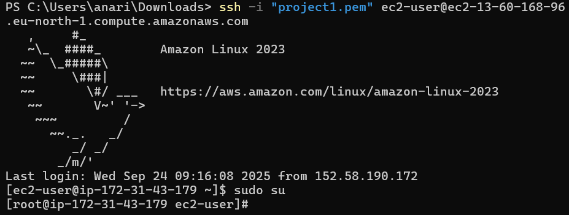
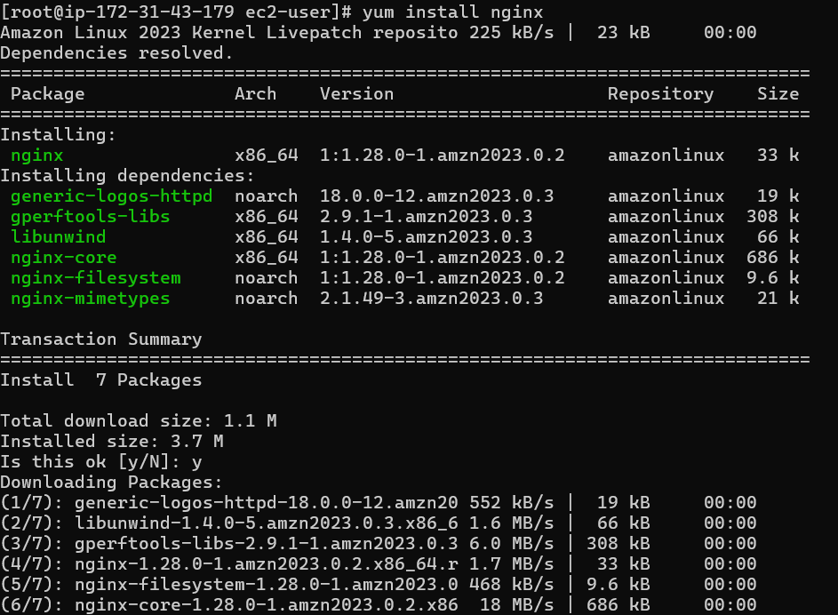

# Managing a Blog Website on a Linux Server  

This project demonstrates how to set up and manage a blog website on an **Amazon EC2 instance** running **Amazon Linux**. The web server is configured using **Nginx** for hosting purposes.  

---

## Project Overview  
- **Project Name:** My-webServer  
- **Cloud Provider:** Amazon Web Services (AWS)  
- **Service Used:** Amazon EC2  
- **Operating System:** Amazon Linux  
- **Instance Type:** t3.micro (Free Tier Eligible)  
- **Web Server:** Nginx  

---

## Steps Performed  

1. **Create IAM User**  
   - Created an IAM user with appropriate permissions for EC2 access.  
   - Configured access keys for secure authentication.  

2. **Launch EC2 Instance**  
   - Launched an EC2 instance using **Amazon Linux AMI**.  
   - Selected **t3.micro** as the instance type.  
   - Named the instance **MyWave Server**.  
   - Created and attached a **Key Pair** for SSH access.  

3. **Connect to the EC2 Instance**  
   - Connected via SSH using the private key file:  
     ```bash
     ssh -i "keypair.pem" ec2-user@<EC2-Public-IP>
     ```
     

4. **Install Nginx Web Server**  
   - Updated the package manager and installed Nginx:  
     ```bash
     sudo yum update -y
     sudo yum install nginx -y
     ```
     

   - Verified installation:  
     ```bash
     nginx -v
     ```
     

5. **Start and Enable Nginx Service**  
   - Start the Nginx service:  
     ```bash
     sudo systemctl start nginx
     ```  
   - Enable Nginx to start on boot:  
     ```bash
     sudo systemctl enable nginx
     ```  
     Output:  
     ```
     Created symlink /etc/systemd/system/multi-user.target.wants/nginx.service → /usr/lib/systemd/system/nginx.service.
     ```  
   - Verify Nginx status:  
     ```bash
     sudo systemctl status nginx
     ```  
     Sample output:  
     

6. **Access Nginx from Browser**  
   - Opened a web browser and navigated to the instance **Public IP address**.  
   - Successfully accessed the Nginx default page (**GUI/status interface displayed**), confirming the web server is running.  
   

# Hosting a Static Website on Nginx

## Downloading a Static Website Template
Instead of creating a website from scratch, we will use a ready-made static website template.

### Steps to Download a Template
1. Visit a free website template provider.
2. Select a preferred template.
3. Download the ZIP file to your local computer.
4. Extract the ZIP file to access the website files.

📥 Inner Peace download link: [Click Here](https://www.tooplate.com/download/2143_inner_peace)

---

## Moving the Website to the Nginx Web Server
Once downloaded, we need to transfer these files to our Linux EC2 instance and place them inside the Nginx web server directory (commonly `/var/www/html/`).

## Navigating the Linux File System
### Changing Directories with `cd`
The **`cd` (Change Directory)** command allows us to move between different directories in the file system.

#### Syntax:
```bash
cd <directory-name>
```
- If used without arguments (`cd`), it navigates to the **home directory**.
- If given a specific directory name, it moves to that directory.

#### Example:
```bash
cd /var/log/nginx
```
This command navigates to the **Nginx log directory**.

#### Example:
```bash
pwd
```
**Output:**
```bash
/var/log/nginx
```
This confirms that we are inside the **Nginx log directory**.

---

## Moving to the Root Directory
To navigate to the **root directory**, use:
```bash
cd /
```
This command takes us to the **top-level directory** of the Linux file system.

### Identifying User & Current Location
To check which user is logged in:
```bash
whoami
```
To check the current directory:
```bash
pwd
```
If we are in `/root`, it means we are in the home directory of the root user.
To navigate to the **absolute top-level directory**, use:
```bash
cd /
```
Now, running `pwd` should display:
```bash
/
```
---
## Listing Files and Directories with `ls`
The **`ls`** command is used to list files and directories inside the current directory.

#### Basic Usage:
```bash
ls
```
This lists the contents of the current directory.

## Moving Between Directories
### Moving One Level Up
To move **one level up** in the directory structure:
```bash
cd ..
```
This takes us to the **parent directory** of the current location.

### Navigating to a Specific Directory
To go to a specific directory, use:
```bash
cd /var/www/html
```
This takes us directly to the **HTML folder** inside the **web server directory**.

---
## Locating Nginx HTML Files in the File System
The default location for **HTML files** served by the **Nginx web server** is:
```bash
/var/www/
```
However, in **Amazon Linux 2**, the default Nginx HTML directory is:
```bash
/usr/share/nginx/html
```

To navigate to this directory, use:
```bash
cd /usr/share/nginx/html
ls
```
This command lists the contents of the HTML directory, which includes the default Nginx welcome page (`index.html`).

---

## Viewing File Contents with `cat`
The **`cat` (Concatenate) command** is used to display the contents of files directly in the terminal.

#### Example:
```bash
cat index.html
```
This command displays the **source code** of the Nginx default welcome page.

To view multiple files at once:
```bash
cat index.html 404.html
```
This command displays the contents of both `index.html` and `404.html`.

---
# Project Completion and Results
## Finalizing the Project
We have successfully learned to navigate the **Linux file system**, manage **files and directories**, and configure a **web server**. Now, we will complete our project by transferring our **website files** to the correct location and verifying the final deployment.

---

## Merging and Displaying File Contents with `cat`
The `cat` command is used to **view, merge, and create files**.

### Viewing Multiple Files
To display the contents of multiple files:
```bash
cat index.html powered-by.png
```
This command shows the contents of both files in sequence.

### Adding Line Numbers
To display line numbers in a file:
```bash
cat -n index.html
```
Each line in the file will now be numbered.

### Merging Files and Saving to a New File
To combine multiple files into one:
```bash
cat index.html powered-by.png > newfile.txt
```
This redirects the contents of `index.html` and `powered-by.png` into `newfile.txt`.

---

## Creating New Files with `touch`
The `touch` command is used to **create an empty file** or **update timestamps**.

### Creating a Single File
```bash
touch newfile.txt
```
### Deleting a File
```bash
rm index.html
```
Deletes `index.html`.

### Deleting a File with Confirmation
```bash
rm -i index.html
```
Prompts before deletion.

### Deleting a Directory and Its Contents
```bash
rm -r mydirectory
```
Removes a directory and all its files.

---

## Transferring Files to the EC2 Instance with `scp`
The `scp` (Secure Copy) command is used to transfer files **securely** between a local machine and a remote server.

### Copying a File from Local Computer to EC2
```bash
scp -i mykey.pem mywebsite.zip ec2-user@<EC2-IP>:/home/ec2-user/
```
- `-i mykey.pem` → Specifies the SSH key.
- `mywebsite.zip` → The file to transfer.
- `ec2-user@<EC2-IP>` → The EC2 user and public IP.
- `/home/ec2-user/` → The destination directory.

### Copying a File from EC2 to Local Machine
```bash
scp -i mykey.pem ec2-user@<EC2-IP>:/home/ec2-user/file.txt .
```
Copies `file.txt` from EC2 to the local machine.

---

## Extracting Files with `unzip`
Once the template files are transferred to the EC2 instance, we need to extract them.
```bash
unzip mywebsite.zip
```
Lists the extracted files.

---

## Moving Files with `mv`
The `mv` (Move) command transfers files and directories to a new location.

### Moving Website Files to Nginx Directory
```bash
sudo mv mywebsite/* /usr/share/nginx/html/
```
Moves all files from `mywebsite` to the **Nginx web server directory**.

---

## Final Verification
After moving the files, we check the contents of the Nginx directory:
```bash
ls /usr/share/nginx/html/
```
If the files are present, our website is ready.

### Accessing the Website
1. Go to **AWS EC2 Console**.
2. Select your **EC2 instance**.
3. Copy the **Public IP Address**.
4. Open a browser and enter:
   ```
   http://<Public-IP>
   ```
5. If the website loads, the deployment is **successful**.

   

### 🎉 Congratulations! You have successfully hosted a static website on an **Amazon Linux EC2 Instance using Nginx**.
---

## Author  
**Aditi Kumari**  

Cloud & DevOps Engineer
