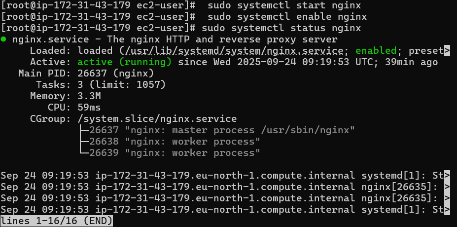

# Managing a Blog Website on a Linux Server  

This project demonstrates how to set up and manage a blog website on an **Amazon EC2 instance** running **Amazon Linux**. The web server is configured using **Nginx** for hosting purposes.  

---

## Project Overview  
- **Project Name:** My-webServer  
- **Cloud Provider:** Amazon Web Services (AWS)  
- **Service Used:** Amazon EC2  
- **Operating System:** Amazon Linux  
- **Instance Type:** t3.micro (Free Tier Eligible)  
- **Web Server:** Nginx  

---

## Steps Performed  

1. **Create IAM User**  
   - Created an IAM user with appropriate permissions for EC2 access.  
   - Configured access keys for secure authentication.  

2. **Launch EC2 Instance**  
   - Launched an EC2 instance using **Amazon Linux AMI**.  
   - Selected **t3.micro** as the instance type.  
   - Named the instance **MyWave Server**.  
   - Created and attached a **Key Pair** for SSH access.  

3. **Connect to the EC2 Instance**  
   - Connected via SSH using the private key file:  
     ```bash
     ssh -i "keypair.pem" ec2-user@<EC2-Public-IP>
     ```
     

4. **Install Nginx Web Server**  
   - Updated the package manager and installed Nginx:  
     ```bash
     sudo yum update -y
     sudo yum install nginx -y
     ```
     

   - Verified installation:  
     ```bash
     nginx -v
     ```
     

5. **Start and Enable Nginx Service**  
   - Start the Nginx service:  
     ```bash
     sudo systemctl start nginx
     ```  
   - Enable Nginx to start on boot:  
     ```bash
     sudo systemctl enable nginx
     ```  
     Output:  
     ```
     Created symlink /etc/systemd/system/multi-user.target.wants/nginx.service → /usr/lib/systemd/system/nginx.service.
     ```  
   - Verify Nginx status:  
     ```bash
     sudo systemctl status nginx
     ```  
     Sample output:  
     

6. **Access Nginx from Browser**  
   - Opened a web browser and navigated to the instance **Public IP address**.  
   - Successfully accessed the Nginx default page (**GUI/status interface displayed**), confirming the web server is running.  
   

   
---

## Author  
**Aditi Kumari**  
Cloud & DevOps Engineer

